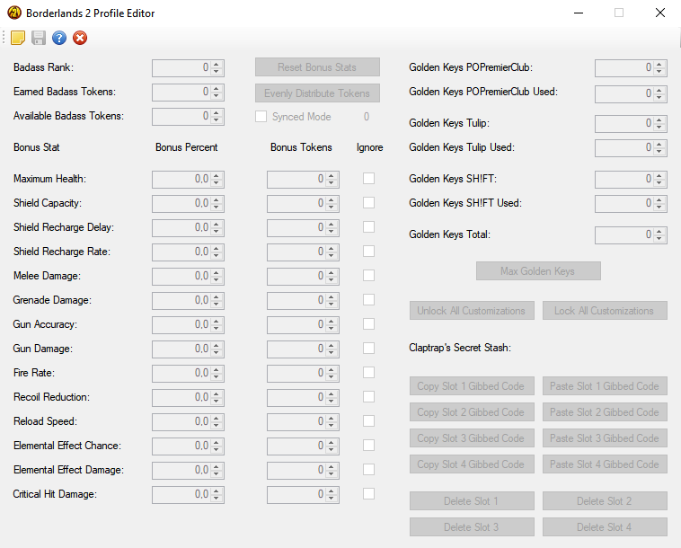

# B2Profile
Borderlands 2 and The Pre-Sequel profile.bin editor

In this repository you will find:

* a B2Profile.dll library that provides an interface to parse a profile.bin, change values in it, and save it again
* a B2ProfileCMD program that uses this library for some examples and proof of concept
* a B2ProfileGUI and BPSProfileGUI that prorvides a graphic interface to edit the interesting values one usually wants to change: Golden Keys, Badass Ranks/Tokens, Claptraps Stash

Partially reverse engineered from the previous Borderlands 2 Profile Editor by Philymaster.

Also check out [B1Profile](https://github.com/withmorten/B1Profile/), which uses the same file format.

Screenshots:

